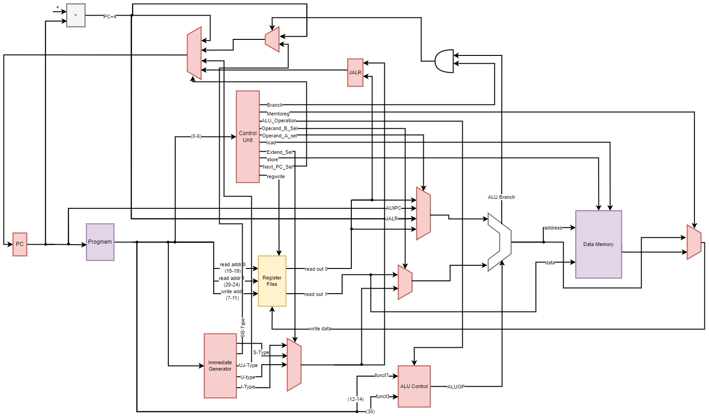

# Risc-V-Single-Cycle-VHDL
This project contains a Single-Cycle RISC-V processor core written in VHDL. The processor core is a part of a field study in the Laboratory of Microelectronics and Embedded Systems, Institut Teknologi Sepuluh Nopember. Prior works include the Computer Organization and Design textbook by Patterson and Hennessy, and [this](https://github.com/merledu/RISC-V-single-cycle-core-Logisim) Single-Cycle Logisim RISC-V Processor by Zeeshan Rafique.

The processor core can run every instruction in the RISC-V RV32I ISA except FENCE, ECALL, and CSSR. We tested the core manually using ModelSim. We successfully run the processor core on a Cyclone IV EP4CE6E22C8 FPGA board. The synthesizer requires around 3,033 logic elements, 1,442 registers, and 16,384 memory bits. The maximum frequency of the processor core is 48.63 MHz.

The test program, compiled using the RISC-V GCC toolchain, is a Fibonacci sequence program that counts from the first Fibonacci number until the last Fibonacci number below 9,999. We hardcoded the test program in a Program Memory, designed as a Read Only Memory, in "progmem.vhd".
